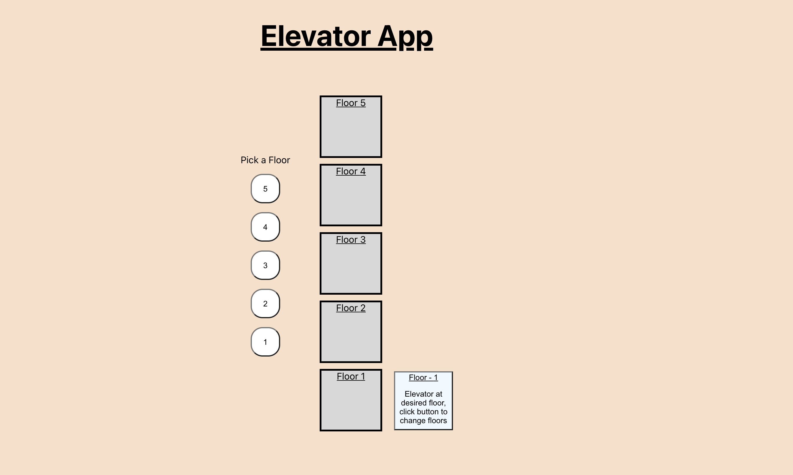

# 20spokes_Challenge
20spokes Elevator Challenge

<!-- PROJECT LOGO -->
<br />
<p align="center">
  <a href="https://github.com/rodriguez-michael/20spokes_Challenge">
    
  </a>

  <h3 align="center">Elevator App</h3>

  <p align="center">
    An pretty cool elevator app.
</p>



<!-- GETTING STARTED -->
## Getting Started

To get a local copy up and running follow these simple steps.


### Installation

1. Clone the repo
   ```sh
   git clone https://github.com/rodriguez-michael/20spokes_Challenge.git
   ```
2. Install NPM packages
   ```sh
   npm install
   ```

<!-- CONTACT -->
## Contact

Michael Rodriguez 
</br>
LinkedIn - https://www.linkedin.com/in/rodriguez-michael/
</br>
Github - https://github.com/rodriguez-michael